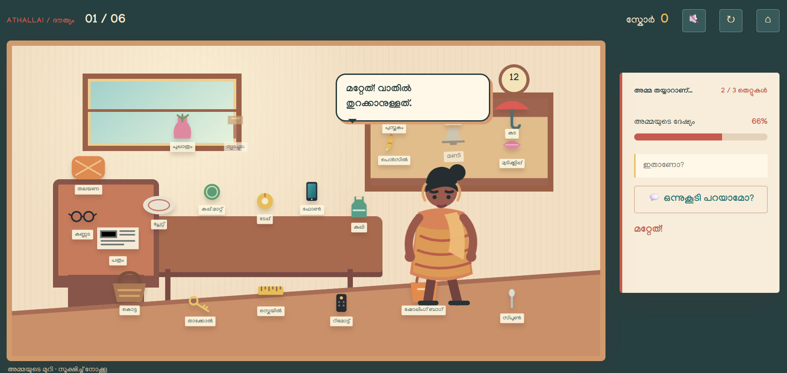
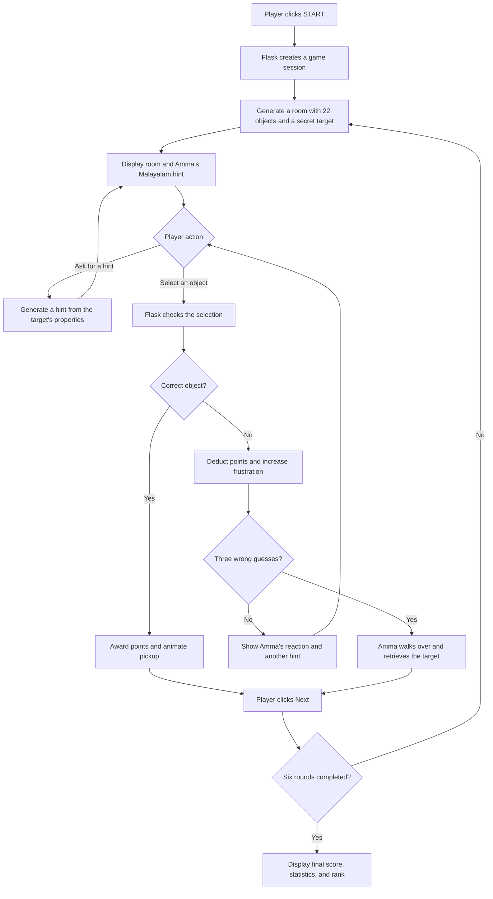

# ATHALLA - Mission Impossible 🎯


## Basic Details

### Team Name: SPARKZZ


### Team Members

- **Team Lead:** Nisamol Sam - St Joseph's College of Engineering and Technology, Choondacherry, Palai
- **Member 2:** K G Vishnuprabha - St Joseph's College of Engineering and Technology, Choondacherry, Palai

### Project Description

**ATHALLA – Mission Impossible** is a fun Malayalam household object-finding web game where Amma gives confusing clues and the player must find the correct item from a room full of objects. Wrong choices trigger funny Malayalam reactions and increase Amma’s frustration, turning a simple household task into an impossible mission.

### The Problem (that doesn't exist)

Amma asks you to bring something from the house, but somehow every object you pick is “ATHALLA!”. A simple task becomes a full-scale mission involving confusing clues, random household objects, and rapidly increasing Amma frustration.

### The Solution (that nobody asked for)

ATHALLA – Mission Impossible turns this painfully familiar experience into a chaotic Malayalam browser game. Players search a room full of clickable objects, interpret Amma’s vague hints, make questionable choices, and survive her hilarious reactions until the mysterious correct item is finally found. After three wrong guesses, Amma retrieves the object herself. Complete six rounds to receive a final score and player rank.

## Technical Details

### Technologies/Components Used

- **Frontend:** HTML, CSS, and Vanilla JavaScript for the screens, clickable objects, and animations.
- **Backend:** Python and Flask for game sessions, randomized rooms, hints, selection checks, and scoring.
- **Graphics:** SVG illustrations for Amma and household objects.
- **Game content:** Malayalam object names, properties, reactions, and player ranks stored in `data.py`; hints generated in `app.py` from the selected object's properties and position.
- **Session storage:** In-memory storage on the Flask server; restarting the server resets active games.

### Implementation

#### Installation

Install Python 3, download or clone this repository, and open a terminal in the project folder. On Windows, run:

```powershell
python -m venv .venv
.\.venv\Scripts\python.exe -m pip install -r requirements.txt
```

#### Run

```powershell
.\.venv\Scripts\python.exe app.py
```

Open [ATHALLA locally](http://127.0.0.1:5004/) in your browser. Keep the terminal running while playing. The game requires the Flask server; opening the HTML file directly or using Live Server does not run the game backend.

### Project Documentation

#### Screenshots


*The welcome screen introduces ATHALLA - Mission Impossible with Amma in a Kerala household setting. Players can start the game or read the Malayalam instructions.*



*The first round shows a room filled with clickable household objects and Amma's Malayalam clue. After two wrong guesses, the side panel displays 66% frustration, along with a button to request another hint.*


*The results screen shows a score of 449 and the “നല്ല കുട്ടി” (good child) rank, with four correct objects, two Amma takeovers, and twelve wrong selections. Players can start another game using the replay button.*

#### Diagrams



*The browser renders the room and animations using HTML, CSS, JavaScript, and SVG. It sends player actions to Flask through JSON API requests. Flask keeps each session's target, guesses, and score, using the object catalog and Malayalam dialogue in `data.py`. A round ends with a correct selection or Amma's takeover after three wrong guesses; the game finishes after six rounds.*

Hardware schematics, circuits, and build photos are not applicable: ATHALLA is a software-only browser game.

### Project Demo

#### Additional Demos

- [Welcome screen](opening%20page.png): the game's introduction and start controls.
- [Gameplay screenshot](gameflow.png): object selection, Malayalam clues, and frustration tracking.
- [Results screenshot](final%20result.png): the final score, player rank, and game statistics.
- **Interactive local demo:** Follow the installation and run instructions above, then open `http://127.0.0.1:5004/` on the computer running Flask.

## Team Contributions

- **Nisamol Sam:** Designed the game interface and room layout, styled the screens with HTML and CSS, and implemented Amma's animations and visual feedback.
- **K G Vishnuprabha:** Developed the Flask backend, randomized object selection, Malayalam hint system, and scoring logic; tested the game flow and prepared the project documentation.

---
Made with ❤️ at TinkerHub Useless Projects 


